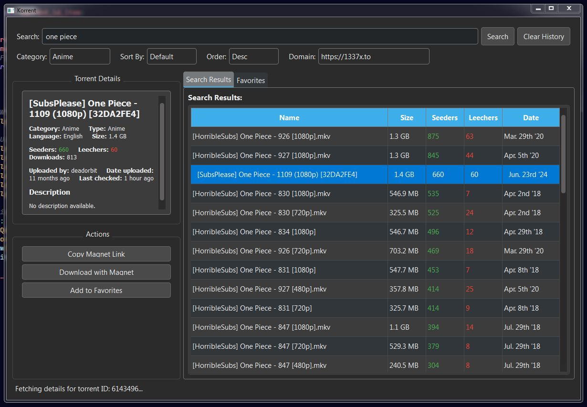

# Korrent

A desktop torrent search application built with Python and PyQt6, featuring automatic server management and multi-provider search capabilities.

## Features

**Multi-Provider Search**
- Search across multiple torrent sources (ThePirateBay, YTS, BitSearch)
- Unified search interface with real-time results
- Advanced filtering by category, size, and quality

**Automatic Server Management**
- Auto-start TorrentApi server when launching
- Visual server status indicators
- Graceful shutdown and cleanup
- No manual server setup required

**Modern Interface**
- Dark theme with professional styling
- Tabbed interface for search results and favorites
- Detailed torrent information with health indicators

**Additional Features**
- Favorites management
- Search history with auto-completion
- Magnet link handling
- Standalone executable generation

## Screenshot



## Architecture

This application consists of two main components:

**Korrent GUI Application** (`torrent_gui_app/`)
- Python/PyQt6 desktop application
- Modern tabbed interface with search and favorites
- Automatic server management and status monitoring

**TorrentApi Server** (`TorrentApi/`)
- Rust-based GraphQL API server
- Multi-provider torrent search backend
- High-performance concurrent searching

## Quick Start

**Option 1: Use Pre-built Executable (Recommended)**

1. Download the latest release
2. Extract the ZIP file
3. Run Korrent.exe
4. No installation required

**Option 2: Run from Source**

1. Clone the repository:
   ```bash
   git clone https://github.com/kozydot/Korrent1337x.git
   cd Korrent1337x
   ```

2. Install Python dependencies:
   ```bash
   cd torrent_gui_app
   pip install -r requirements.txt
   ```

3. Build TorrentApi server:
   ```bash
   cd ../TorrentApi
   cargo build
   ```

4. Run the application:
   ```bash
   cd ../torrent_gui_app
   python app.py
   ```

## Building Standalone Executable

Create your own standalone executable:

```bash
cd torrent_gui_app
python build_standalone.py
```

The executable will be created in `dist/Korrent.exe` with all dependencies bundled.

## Requirements

**For Running from Source:**
- Python 3.8+
- Rust 1.70+ (for building TorrentApi server)
- PyQt6, requests, pyperclip (automatically installed)

**For Pre-built Executable:**
- Windows 10/11 (64-bit)
- No additional requirements

## Usage

1. Launch Korrent (executable or `python app.py`)
2. Wait for the server status to show "Server running"
3. Enter your search query
4. Select providers and filters (optional)
5. Click "Search" to find torrents
6. Select a result to view detailed information
7. Copy magnet links or open them in your torrent client
8. Add favorites for easy access later

**Advanced Features:**
- Test Connection: Verify server connectivity
- Provider Selection: Choose specific torrent sources
- Search History: Access previous searches
- Favorites Management: Save and organize torrents

## Legal Notice

This application is designed for searching publicly available torrent files. Users are responsible for ensuring they have legal rights to download any content. Respect copyright laws in your jurisdiction.

## Contributing

Contributions are welcome! Please feel free to submit pull requests or open issues for bugs and feature requests.

## Credits

This application uses **TorrentApi** by Netfloex for torrent search functionality.

- **TorrentApi**: https://github.com/Netfloex/TorrentApi - Rust-based GraphQL torrent search API
- **PyQt6**: Cross-platform GUI framework
- **Various torrent providers**: For making content discoverable

## License

This project is open source. Please check individual component licenses:
- Korrent GUI: MIT License
- TorrentApi: Check TorrentApi repository for license details
